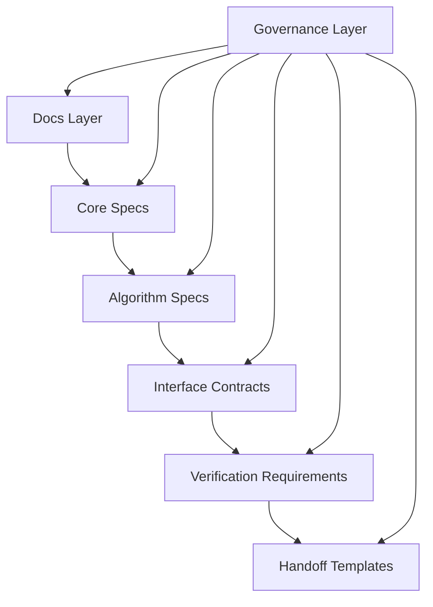

# Specification Layers

This page maps the canonical layers so Mac/iOS maintainers can navigate with minimal ambiguity.

## Layer Stack

## Layer-by-Layer Map

| Layer | Scope | Primary files |
|---|---|---|
| Docs | Purpose, philosophy, roadmap, shape | `docs/00..03` |
| Core specs | State model, codeword set, admissibility, diagnostics, classification | `specs/core/*` |
| Algorithms | Transform, averaging, branching, transitions, recovery/fallback, containment/safe halt, planning | `specs/algorithms/*` |
| Registries | Canonical fallback policy structure and ordering rules | `specs/registries/fallback-policy-registry.md` |
| Interfaces | Semantic contracts, diagnostic schema, rule ID taxonomy, module contracts | `specs/interfaces/*` |
| Verification | Invariants, conformance categories, acceptance language | `specs/verification/*` |
| Handoff templates | Apple-platform delivery shape and proof artifacts | `handoff-templates/*` |
| Governance | Repository rules, coding-handoff rules, protected workflow policies | `governance/*` |

## Reading Sequence For New Maintainers

1. `README.md`
2. `docs/*`
3. `specs/core/*`
4. `specs/algorithms/*`
5. `specs/interfaces/*`
6. `specs/verification/*`
7. `handoff-templates/*`
8. `governance/*`

## Maintenance Rule

When semantics change, update spec layers first, then contracts/verification as needed, then refresh docs/wiki summaries.
